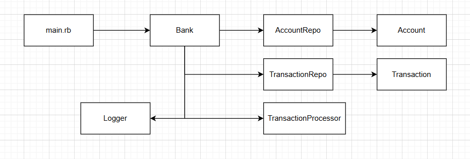

# Architecture of the application

Design of this architecture follows the seperation of concerns in order to make it easy to maintain and expand.

- `main.rb` holds the top level orchestration. It initialises bank and defines file paths. Also, it is the entry point to the application which runs the method `.run` of bank class.

- `Bank` is the core orchestration which doordinates everything using other components. It uses `AccountRepo`, `TransactionRepo` and `TransactionProcessor` to load data, process them and export results.

- `AccountRepo` and `TransactionRepo` are responsible for loading input data and exporting final results to an output file. They use domain models for `Account` and `Transaction`

- `TransactionProcessor` holds the business logic for this application. It processes single transaction at a time. Debit on `from_acc` and credit on `to_acc` is the most inportant section here. Since it tries to debit first, which is possible to dail due to insufficient amount, these updates are done with atomicity. Also, the error handelling is done in order to proceed when one transaction fails and to log the failed transactions.

- `Account` and `Transaction` are domain models which define with attributes and methods.
